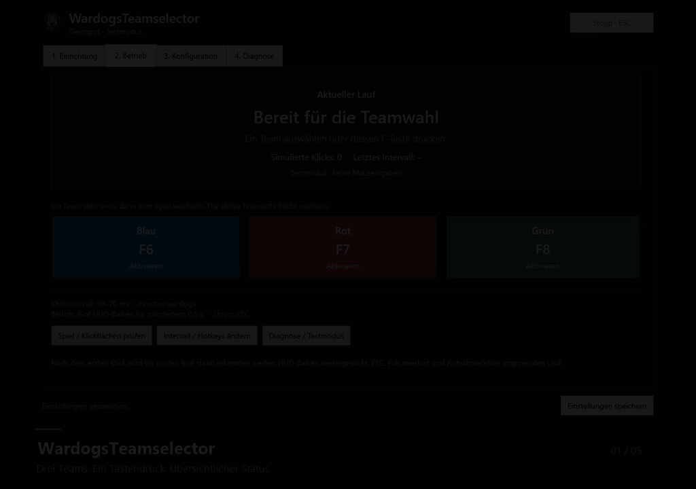

# 🐺 WardogsTeamselector

Wähle dein Team in Wardogs mit einem Tastendruck. Das Windows-Tool klickt dein gewünschtes Team wiederholt an und beendet den Lauf, sobald es den Beitritt im Spiel erkennt.

## 📥 Herunterladen

**[Zur neuesten Version →](https://github.com/Gamewalker/WardogsTeamselector/releases/latest)**

Lade unter **Assets** die passende EXE herunter und starte sie – eine Installation des Tools ist nicht nötig.

- **Mit Runtime:** `WardogsTeamselector-win-x64-with-runtime.exe` – enthält alles zum Starten. Die passende Wahl, wenn du dir unsicher bist.
- **Ohne Runtime:** `WardogsTeamselector-win-x64-without-runtime.exe` – kleinerer Download, benötigt die installierte **[.NET 10 Desktop Runtime (x64)](https://aka.ms/dotnet/10.0/windowsdesktop-runtime-win-x64.exe)**.

Beide Varianten bieten dieselben Funktionen und nutzen dieselben Einstellungen. Du brauchst **Windows x64** und Wardogs.

## 🎬 So sieht das Tool aus

[Video in voller Qualität ansehen oder herunterladen](https://github.com/Gamewalker/WardogsTeamselector/raw/refs/heads/main/docs/media/wardogs-teamselector-demo.mp4) · 21 Sekunden · ohne Ton

Die Tour zeigt die Oberfläche im Testmodus mit einem statischen Spielreferenzbild.

## 🚀 In wenigen Schritten loslegen

1. **Wardogs öffnen** und zum Teamauswahlbildschirm wechseln.
2. Im Tool unter **Einrichtung** auf **Spiel suchen / Bild laden** klicken. Prüfe, ob die farbigen Teamrahmen und ihre Klickpunkte auf den richtigen Karten liegen.
3. Mit **Speichern & zum Betrieb** die Einrichtung abschließen.
4. Zunächst im **Testmodus** ausprobieren: Ein Team per Button oder F-Taste aktivieren und den Status beobachten. Beim ersten Start werden keine echten Klicks gesendet.
5. Wenn alles passt, unter **Diagnose → Testmodus verwenden** den Testmodus ausschalten. Danach dein Team erneut aktivieren.

Das Tool holt das passende Spielfenster bei einer Teamaktivierung automatisch in den Vordergrund. Diese Option kannst du unter **Konfiguration → Spielfokus** ändern.

## ⌨️ Dein Team auf Knopfdruck

| Taste | Aktion |
| --- | --- |
| **F6** | 🔵 Blau aktivieren |
| **F7** | 🔴 Rot aktivieren |
| **F8** | 🟢 Grün aktivieren |
| **ESC** | ⏹️ Lauf sofort stoppen |

Du kannst ein Team schon vor der Auswahl aktivieren. Nach dem ersten Klick versucht das Tool dasselbe Team weiter, bis die fünf weißen HUD-Balken unten rechts mindestens **0,5 Sekunden** stabil erkannt werden. Mit **ESC** oder **Stopp** kannst du jederzeit abbrechen.

Die Tastenkürzel und Klickintervalle lassen sich unter **Konfiguration** anpassen. **Einstellungen speichern** sichert deine Änderungen für den nächsten Start.

## 💡 Gut zu wissen

- Halte das Spielbild frei: Das Toolfenster sollte den Teamauswahldialog nicht verdecken. Ein zweiter Monitor ist praktisch.
- Bei anderen Seitenverhältnissen, HDR oder abweichender UI-Skalierung solltest du die [Kalibrierung prüfen](docs/calibration.md).
- Veröffentlichte Versionen suchen automatisch nach Updates. Das Update wird beim Beenden installiert und ist beim nächsten Start verfügbar. [Mehr zu Updates](docs/updates.md)

## 📚 Hilfe und weitere Infos

- [Ausführliche Bedienung](docs/usage.md)
- [Bildschirm und Teamflächen einrichten](docs/calibration.md)
- [Probleme lösen und Diagnose verwenden](docs/troubleshooting.md)
- [Alle Dokumentationsseiten](docs/README.md), einschließlich Entwicklung und Versionshinweisen

Etwas funktioniert nicht? [Melde ein Problem auf GitHub](https://github.com/Gamewalker/WardogsTeamselector/issues) mit dem Statusgrund und möglichst einem Diagnoseexport.

## 📜 Lizenz

WardogsTeamselector steht unter der **GNU GPL v3.0**. Den vollständigen Text findest du in [LICENSE](LICENSE), weitere Informationen auf der [Lizenzseite](docs/license.md).
