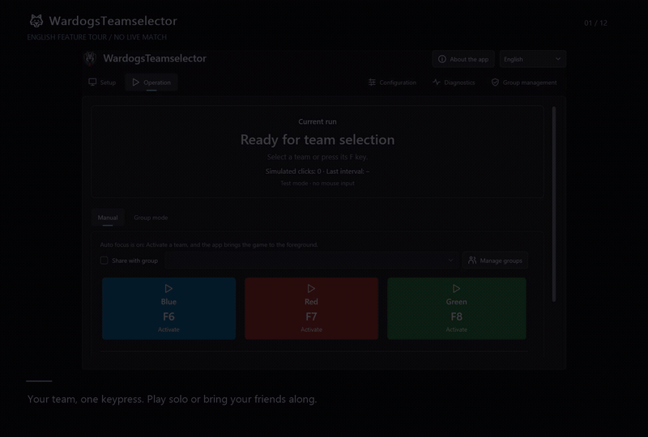

# 🐺 WardogsTeamselector

Choose your Wardogs team with one keypress — and bring your friends along. This free, open-source Windows tool keeps trying your chosen team and stops automatically once it recognizes that you have joined the game.

## 📥 Download

**[Get the latest release →](https://github.com/Gamewalker/WardogsTeamselector/releases/latest)**

Under **Assets**, download an EXE and run it. No installation of the tool is required.

- **With runtime:** `WardogsTeamselector-win-x64-with-runtime.exe` — choose this if you are unsure.
- **Without runtime:** `WardogsTeamselector-win-x64-without-runtime.exe` — a smaller download if you already have the **[.NET 10 Desktop Runtime (x64)](https://aka.ms/dotnet/10.0/windowsdesktop-runtime-win-x64.exe)**.

Both downloads offer the same features. You need **Windows x64** and Wardogs. Keep the EXE in a folder where the app can save updates.

## 🎬 English video tour

**[Watch or download the English video](https://github.com/Gamewalker/WardogsTeamselector/raw/refs/heads/main/docs/media/wardogs-teamselector-demo-en.mp4)** · 72 seconds · English captions · no audio

[English captions (SRT)](docs/media/wardogs-teamselector-demo-en.srt)

Explore team selection, shared teams, automatic following, invitations, personal settings and updates. The tour shows the app with sample screens and a demo group; it does not show a live match.

## 🚀 Quick start

1. **Open Wardogs** and go to the team selection screen.
2. In **Setup**, choose **Find game / load image**. Check that the colored outlines and click points match the three team cards. Adjust them if needed.
3. Choose **Save & open Operation**.
4. **Try test mode first:** open **Diagnostics** and turn on **Use test mode · no mouse input**, then choose a team with its button or F-key and watch the status. New profiles start with test mode off.
5. When everything looks right, open **Diagnostics**, turn off **Use test mode · no mouse input**, save, and activate your team again.

The app normally brings Wardogs to the foreground for you. You can turn this off in **Configuration → Game focus** and switch to the game yourself.

## ⌨️ Team controls

| Default key | Action |
| --- | --- |
| **F6** | 🔵 Choose Blue |
| **F7** | 🔴 Choose Red |
| **F8** | 🟢 Choose Green |
| **END** | ⏹️ Stop the attempt or group following |

Choose a team even before the selection screen appears: the app waits until the game is ready, then keeps trying your choice. Once it recognizes that you have joined, clicking stops automatically.

During an attempt, your team button becomes **Stop**. The other team buttons stay available if you want to switch. In **Configuration**, choose your own keys for all three teams and **Stop**, including function keys, arrow keys and other special keys. END is the default stop key. Save your choices to keep them after restarting, and adjust the click speed to suit you.

## ✨ Features

- **🔵 Your team, one keypress:** choose Blue, Red or Green with a button or shortcut, switch teams during an attempt, and stop at any time. Customize all four shortcuts to suit your keyboard.
- **⏳ Ready when the game is:** activate your team early and let the app wait for the team selection screen. Automatic game focus helps you get started.
- **✅ Automatic stop after joining:** the app recognizes the in-game display and ends the attempt for you. Clear status messages show whether it is waiting, trying or stopped.
- **👥 Play together:** share your team choice with a group so approved members can follow the same choice from their own PCs.
- **🔁 Join once or keep following:** join the group's current choice once, or enable **Auto follow** for future team selection screens. Auto stays ready after a successful join and waits through temporary connection problems. It remembers your choice when you reopen the app.
- **✉️ Invite and manage your friends:** create multiple groups, share invitation links, approve or decline requests, remove members, replace an invitation link or withdraw a shared team choice. Members can leave whenever they want.
- **🔑 Take your groups with you:** use a private recovery code when moving to another PC. Copy a group's admin access to another instance, or transfer it exclusively so previous admin access is revoked.
- **🎯 Setup that fits your screen:** find the game automatically, choose a monitor and adjust the game area, team outlines and click points with a visual preview.
- **🧪 Test before you click:** test mode lets you check the setup without mouse input. Diagnostics offers reference checks, screenshots, logs and an export to help explain a problem.
- **💾 Remember your preferences:** save your setup, keep your shortcuts and restore your checkbox choices, including team sharing and Auto follow. A saved, valid setup opens directly in Operation.
- **🌍 20 interface languages:** switch languages in the header without restarting. The app remembers your choice, and the interface translations work offline. English is the first-launch default; newer group messages currently use English outside German and English.
- **🌙 A clear, dark interface:** Windows 11 styling, recognizable team colors and five dedicated areas — Setup, Operation, Configuration, Diagnostics and Group management.
- **🔄 Easy updates:** the app checks for new releases regularly. Install a ready update with **Update** and restart, or let it install when you close the app. Your settings and download variant are kept; manual checks and optional automatic downloads are available too.
- **🐛 Help within reach:** open the project, license or a prepared bug report from **About the app**. Review the report before sending it on GitHub.

Available interface languages: English, German, Spanish, Italian, Portuguese, Polish, Dutch, French, Turkish, Russian, Ukrainian, Arabic, Hindi, Bengali, Indonesian, Vietnamese, Thai, Simplified Chinese, Japanese and Korean.

## 👥 Get your group together

1. Open **Group management**, create a group and copy its invitation link.
2. Your friends choose **Join group**, paste the link and enter their names.
3. Approve their requests in **Group management**.
4. In **Operation → Manual**, enable **Share with group**, choose your group and activate a team.
5. Your friends select that group in **Group mode** and choose **Join once** or **Auto follow**.

Groups need an internet connection. A group service is already selected for new setups; you can also use your own. Sharing a team choice helps everyone aim for the same team, but does not reserve places or move players out of a running match. Stopping your local attempt does not withdraw an already shared choice.

Keep recovery and admin transfer codes private. See the [group guide (German)](docs/groups.md) for managing groups, transferring access and restoring memberships.

## 📚 Help and troubleshooting

Keep the game's team selection screen visible and unobstructed. A second monitor can help. If the outlines do not match your screen, check Setup before enabling real clicks — especially with HDR, unusual scaling or a different screen shape.

If the app keeps waiting, check the selected game window, monitor and game focus. If an attempt stops unexpectedly, read the status message and open Diagnostics. Activate your team again when the issue is resolved.

The detailed guides are currently **in German**:

- [Usage guide](docs/usage.md)
- [Game area and team calibration](docs/calibration.md)
- [Groups and shared team selection](docs/groups.md)
- [Troubleshooting and diagnostics](docs/troubleshooting.md)
- [Automatic updates](docs/updates.md)
- [Documentation index and release notes](docs/README.md)

**[Report a problem on GitHub](https://github.com/Gamewalker/WardogsTeamselector/issues)** with what happened, your app version and the status message. A diagnostic export or screenshot can help. You can also start a report from About the app or Diagnostics.

## 🛠️ For contributors

Want to help improve the app? See [development](docs/development.md) and [testing](docs/TESTING.md) for build instructions and checks, or the [video source](docs/media/demo-source/README.md) to update the tour. These guides contain the technical details.

## 📜 License

WardogsTeamselector is free and open source under **GNU GPL v3.0**. See [LICENSE](LICENSE) and the [license guide (German)](docs/license.md).
