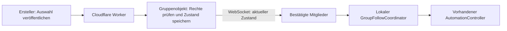

# Gruppenmodus und Online-Synchronisierung – Funktionsplan

[← Dokumentation](README.md)

Status: Auf dem Featurebranch implementiert; Backend und Client werden geprüft. Cloudflare-Live-Bereitstellung auf Wunsch des Nutzers bis zum nächsten verfügbaren Zugang verschoben. Kein Merge und keine neue App-Veröffentlichung. Anbieterunterlagen wurden am 8. Oktober 2026 geprüft. Die Umsetzung verwendet lokale Identität mit Wiederherstellungscode und Auto bei sicher erkanntem Teamauswahlbildschirm.

Bestätigte Rahmenbedingungen: Die eigene Gruppe umfasst etwa zehn Personen. Das Tool ist öffentlich; die Gesamtnutzerzahl ist unbekannt. Während eine Gruppe aktiv verwendet wird, muss bei erreichbarem Dienst mindestens einmal pro Minute der aktuelle autorisierte Zustand geprüft werden. Änderungen sollen zusätzlich sofort per WebSocket eintreffen.

## Ziel und vorhandene Anwendung

Nutzer können eine Gruppe erstellen, per Link andere Personen einladen, Beitrittsanfragen bestätigen und Mitglieder entfernen. Bestätigte Mitglieder können der online veröffentlichten Teamauswahl des Erstellers folgen.

Die Anwendung ist eine portable Windows-WPF-Anwendung mit .NET 10. Im bisherigen Bereich „Betrieb“ startet eine Teamtaste oder ein Hotkey unmittelbar `StartTeam`. `AutomationController` führt genau einen Beitrittsversuch aus und stoppt nach erfolgreicher HUD-Erkennung. Die neue Gruppensteuerung ergänzt den dauerhaften Auto-Modus.

Der neue Gruppenbereich ergänzt diesen Ablauf. Die Bildschirmkalibrierung, Klickintervalle, Testmodus und Eingabeprüfung bleiben pro PC eingestellt. Online werden Gruppenzugehörigkeit und das gewünschte Team geteilt.

## Vorgeschlagene Produktentscheidungen

- Zwei Tabs im Bereich „Betrieb“: „Manuell“ und „Gruppenmodus“.
- Ein Ersteller verwaltet die Mitglieder und veröffentlicht die Teamauswahl. Mitglieder dürfen beitreten, die Gruppe verlassen und ihrer Auswahl folgen.
- Eine Person kann mehreren Gruppen angehören, aber nur einer Gruppe gleichzeitig aktiv folgen.
- Zunächst ohne Benutzerkonto: Zugangsdaten werden auf diesem PC gespeichert. Ein exportierbarer Wiederherstellungscode übernimmt sie bei einem PC-Wechsel.
- „Auto“ bedeutet: Der Nutzer aktiviert das Folgen ausdrücklich. Das Tool verwendet bei kommenden Teamauswahlbildschirmen die aktuelle Auswahl der Gruppe. Ein Teamwechsel verlässt kein bereits laufendes Spiel.
- Nach App-Neustart ist Auto zunächst aus. Die zuletzt gewählte Gruppe wird wieder angezeigt.

## Gruppe erstellen und verwalten

1. „Gruppe erstellen“ öffnen, Gruppenname und eigenen Anzeigenamen eingeben.
2. Der Server legt die Gruppe an und erteilt diesem Client die Erstellerrechte.
3. „Einladungslink kopieren“ liefert einen HTTPS-Link. Der Link erlaubt eine Beitrittsanfrage, aber gewährt noch keine Mitglieds- oder Erstellerrechte.
4. Die Gruppenverwaltung zeigt bestätigte Mitglieder und separat offene Anfragen mit „Bestätigen“ und „Ablehnen“.
5. „Entfernen“ entzieht einem Mitglied serverseitig den Zugriff und beendet dessen bestehende Gruppenverbindung. Eine erneute Anfrage braucht erneut die Zustimmung des Erstellers.
6. Der Ersteller kann den Einladungslink widerrufen und einen neuen erzeugen. Bereits bestätigte Mitgliedschaften bleiben bestehen.
7. Mitglieder können die Gruppe verlassen. Der Ersteller kann die Gruppe löschen; Löschung beendet alle Gruppenläufe. Eine Übertragung der Erstellerrolle gehört zunächst nicht zum Umfang.

Namen dienen der Anzeige und identifizieren keine Person verlässlich. Rechte hängen an geheimen Zugangsdaten. Doppelte Namen sind deshalb möglich; die Verwaltung zeigt zusätzlich eine kurze Mitgliedskennung und den Anfragezeitpunkt.

## Per Link beitreten

1. Der HTTPS-Link öffnet eine kleine Einladungsseite mit dem Gruppennamen, einer Downloadmöglichkeit und der Erklärung, den Link im Tool unter „Gruppe beitreten“ einzufügen.
2. Im Tool gibt der Eingeladene seinen Anzeigenamen ein und sendet die Anfrage.
3. Das Tool speichert eine geheime Anfragekennung lokal. Die Gruppe erscheint mit „Wartet auf Bestätigung“ und kann noch keinen Spielbeitritt steuern.
4. Nach Bestätigung erhält dieser Client Mitgliedsrechte; bei Ablehnung erscheint ein verständlicher Status.

Das Einfügen des Links funktioniert auch mit der portablen EXE ohne Installation. Ein optionales „Im Tool öffnen“ per Windows-URI-Protokoll kann später ergänzt werden; es benötigt eine gesonderte Registrierung. Für Version 1 wird kein automatischer App-Aufruf vorausgesetzt.

## Tab „Manuell“

Die bisherigen Teamtasten und Hotkeys starten weiterhin den normalen lokalen Ablauf.

Ersteller erhalten zusätzlich eine Aktion „Auswahl mit Gruppe teilen & beitreten“. Dort wählen sie eine eigene Gruppe und das Team. Die Anwendung validiert zuerst die lokalen Einstellungen, veröffentlicht dann die Auswahl und startet nach der Serverbestätigung den lokalen Beitrittsversuch.

Scheitert die Veröffentlichung, zeigt die Oberfläche „Auswahl nicht geteilt“ und bietet separat „Nur lokal beitreten“. Sie behauptet keinen erfolgreichen Gruppensync. Stoppt später der lokale Versuch, bleibt die veröffentlichte Auswahl bestehen, bis sie geändert oder zurückgenommen wird.

Jede ausdrückliche Veröffentlichung erzeugt eine neue Auswahlversion, auch wenn erneut dieselbe Teamfarbe gewählt wurde. So kann der Ersteller einen weiteren gemeinsamen Beitritt anstoßen. Die Auswahl bleibt bis zu einer Änderung oder „Auswahl zurücknehmen“ gültig; eine zeitliche Begrenzung ist eine mögliche spätere Erweiterung.

Eine lokale manuelle Aktivierung beendet auf diesem PC das aktive Folgen einer Gruppe. Gewöhnliche Hotkeys veröffentlichen keine Auswahl online; das Teilen bleibt eine erkennbare zusätzliche Aktion.

## Tab „Gruppenmodus“

- Zeigt lokal bekannte Gruppen mit aktuellem Status: Ersteller, bestätigt, ausstehend, entfernt oder nicht erreichbar. Entfernte Gruppen können aus der lokalen Liste gelöscht werden.
- Zeigt nach Auswahl einer Gruppe deren Ersteller und das veröffentlichte Team sowie den Verbindungsstatus.
- Bietet „Einmal beitreten“ und den Schalter „Auto folgen“. Beide holen zuerst einen autorisierten aktuellen Zustand vom Server.
- Ohne veröffentlichte Auswahl kann Auto auf eine Veröffentlichung warten; „Einmal beitreten“ bleibt deaktiviert.
- Für eigene Gruppen ist „Gruppe verwalten“ erreichbar; „Gruppe erstellen“ und „Gruppe beitreten“ stehen direkt in diesem Tab bereit.
- Zeigt getrennt den Online-Status und den lokalen Laufzustand, etwa „Verbunden · Team Rot“ und „Warte auf Teamauswahl“.

## Automatik und Zusammenspiel mit der Klicksteuerung

Ein neuer `GroupFollowCoordinator` verwaltet das Folgen unabhängig von `AutomationController`. Er kann einmalig starten oder nach jedem beendeten Spielbeitritt auf den nächsten Teamauswahlbildschirm warten.

| Ereignis | Vorgeschlagene Reaktion |
| --- | --- |
| Gruppe auswählen | Vorherigen Gruppenlauf stoppen; aktuellen Zustand der neuen Gruppe laden. Die Auswahl allein startet keine Klicks. |
| Einmal beitreten | Aktuelle Mitgliedschaft und Teamauswahl laden; genau einen normalen Versuch starten. |
| Auto einschalten | Verbindung herstellen; auf aktuellen Gruppenstatus, Spielfokus und stabilen Teamauswahlbildschirm warten. |
| Auswahlversion ändert sich während eines Versuchs | Alten Versuch synchron stoppen; neues Team erst nach erneut stabil erkanntem Teamauswahlbildschirm starten. |
| Auswahl ändert sich während des Spiels | Neues Team vormerken; beim nächsten Teamauswahlbildschirm verwenden. |
| HUD bestätigt den Beitritt | Klicks stoppen; bei Auto auf einen neuen Teamauswahlbildschirm warten. |
| Auswahl zurückgenommen | Lauf stoppen; Auto wartet auf eine neue Veröffentlichung. |
| ESC, Stopp, Auto aus oder manuelle Teamaktivierung | Lokalen Lauf stoppen und Auto deaktivieren. Spätere Online-Updates dürfen ihn nicht erneut starten. |
| Mitglied entfernt oder Gruppe gelöscht | Lauf stoppen, Auto deaktivieren, Zugriff entziehen und Status anzeigen. |
| Verbindungsabbruch | Gruppenlauf pausieren/stoppen und Auswahl als nicht aktuell kennzeichnen. Nach Wiederverbindung vollständigen Zustand laden. |
| Fokusverlust, Aufnahmefehler oder geänderte Geometrie | Bestehenden Schutzstopp beibehalten; Auto pausieren und erneute lokale Freigabe verlangen. |

Automatische Netzwerkupdates holen das Spielfenster nicht in den Vordergrund. Bei einem ausdrücklich vom Nutzer gestarteten Beitritt kann die vorhandene Option zum Spielfokus weiter gelten.

Der heutige Controller klickt nach dem ersten Klick bis zur HUD-Bestätigung weiter. Deshalb darf ein Online-Teamwechsel nicht einfach ein Teamfeld im laufenden Versuch ändern: Der alte Lauf muss zuerst beendet werden. Es bleibt bei genau einem Klickworker, der zentral die Mindestintervalle und Stoppgarantien durchsetzt.

Nach HUD-Erfolg muss der neue Coordinator den Übergang zu einem stabilen neuen Teamauswahlbildschirm erkennen. Er verwendet dafür dieselben Bildschirmdienste und Detektoren, mit einer sparsamen Prüfung im wartenden Zustand. Doppelte hochfrequente Aufnahme- oder Klickschleifen werden vermieden. Unterschiedliche Stoppursachen werden typisiert, statt Auto anhand übersetzter Statustexte zu steuern.

## Empfohlene kostenlose Online-Architektur

**Cloudflare Workers Free + ein SQLite-basiertes Durable Object pro Gruppe + WebSockets mit Hibernation.**

Der Worker liefert die API und die kleine Einladungsseite unter einer kostenlosen `workers.dev`-Adresse. Das Gruppenobjekt speichert Mitglieder, Anfragen, Einladungen und die Auswahl dauerhaft. Es prüft die Rechte und ordnet Änderungen innerhalb einer Gruppe. Änderungen werden zuerst gespeichert und anschließend an die berechtigten verbundenen Clients gesendet.

Eine zusätzliche D1-Datenbank wird für die erste Version nicht benötigt. Die App kennt ihre Gruppen aus dem lokalen Mitgliedschaftsspeicher. Beim Öffnen der Gruppenliste aktualisiert sie die bekannten Einträge; eine dauerhafte Verbindung wird nur für die aktiv verfolgte Gruppe oder die gerade geöffnete Verwaltung gehalten. Eine Wiederherstellung setzt den exportierten Code voraus. Gruppen allein über einen Namen wiederzufinden ist ohne Konto nicht vorgesehen.

### Synchronisationsvertrag

- Jedes Gruppenobjekt vergibt eine steigende `revision`; die Auswahl hat zusätzlich eine eigene `selectionVersion`. Mitgliederänderungen lösen dadurch keinen neuen Spielbeitritt aus.
- Nachrichten enthalten die Protokollversion, Gruppenkennung, Revision und den für diesen Empfänger erlaubten Zustand. Mitglieder erhalten keine geheimen Tokens anderer Personen; offene Anfragen sind nur für den Ersteller sichtbar.
- Bei jeder Erstverbindung und Wiederverbindung erhält der Client einen vollständigen aktuellen Snapshot. Für Version 1 ist kein dauerhaftes Ereignisarchiv erforderlich.
- Während eine Gruppe aktiv verwendet wird, fragt jeder Client spätestens alle 60 Sekunden über den bestehenden WebSocket den aktuellen autorisierten Gruppenstatus ab. Die Antwort bestätigt die aktuelle Revision, Mitgliedschaft und Auswahl; ein bloßes Transport-Ping erfüllt diese Anforderung nicht. Der erste Abgleich erfolgt sofort beim Aktivieren. Bei unveränderter Revision reicht eine kompakte Zustandsbestätigung; bei Abweichung wird ein vollständiger Snapshot übertragen.
- Doppelte oder ältere Revisionen werden ignoriert. Neue Nachrichten werden pro aktivem Gruppenlauf geordnet verarbeitet. Antworten auf eine inzwischen abgewählte Gruppe oder auf vor ESC gestartete Anfragen werden verworfen.
- Schreibaktionen erhalten eine `operationId`, damit Wiederholungen nach Timeouts keine doppelten Veröffentlichungen oder Anfragen erzeugen. Der Server begrenzt die Aufbewahrung dieser Kennungen.
- Zustandsabfrage, WebSocket-Verbindungsaufbau und jede schreibende Aktion prüfen die aktuelle Mitgliedschaft und Rolle serverseitig. Einladungsrechte können keine Auswahl ändern oder Mitglieder freigeben.
- Entfernen schließt auch vorhandene Verbindungen. Im seltenen Fall eines unbemerkten Verbindungsabbruchs begrenzt eine maximal 75 Sekunden gültige Online-Freigabe die weitere lokale Gruppensteuerung. Eine Zustandsabfrage hat einen Timeout von zehn Sekunden; bei Timeout wird der Gruppenlauf pausiert. Die Freigabe wird nur nach Prüfung der aktuellen Mitgliedschaft erneuert; Transport-Pings allein verlängern sie nicht.
- Nach Ablauf dieser Freigabe stoppt der lokale Lauf. Die Freigabe wird direkt im Eingabeworker durchgesetzt; blockierte UI-Timer können sie nicht verlängern. Der Zeitstempel stammt vom tatsächlichen Nachrichteneingang, nicht von der späteren UI-Verarbeitung. Sofortiger Entzug auf einem vollständig offline befindlichen PC ist technisch nicht möglich. Manipulierte Clients können weiterhin eigenständig manuell klicken; entzogen wird der Zugang zum Gruppendienst.
- Wiederverbindungsversuche verwenden steigende Wartezeiten mit Zufallsanteil. Bei Kontingentfehlern gelten längere Pausen statt einer schnellen Wiederholungsschleife.

### Zugangsdaten und Speicher

Einladungslinks enthalten einen zufälligen, widerrufbaren Einladungswert. Mitglieder und Ersteller erhalten getrennte geheime Zugangsdaten. Namen verleihen keine Rechte. Der Server speichert die Token-Hashes; API-Zugangsdaten werden bei HTTP-Aufrufen im Authorization-Header über TLS übertragen.

Der Desktop speichert die Geheimnisse mit Windows-DPAPI geschützt, getrennt von den Kalibrierungseinstellungen. Diagnoseexporte enthalten keine Tokens oder vollständigen Einladungslinks. Ein Wiederherstellungscode ist ein bewusst erzeugter geheimer Export der Mitgliedschaften und Erstellerrechte. Wer diesen Code besitzt, besitzt diese Rechte; die App ermöglicht den Widerruf und Ersatz kompromittierter Zugangsdaten.

Anfragen ohne Freigabe haben ein begrenztes Ablaufdatum. Gruppengröße, Gruppenanlage, offene Anfragen und API-Aufrufe werden begrenzt, Namen validiert und Berechtigungen bei jeder Aktion geprüft. Ausgangspunkt für den Prototyp: höchstens 50 bestätigte Mitglieder und 50 offene Anfragen pro Gruppe. Die tatsächlichen Grenzen werden nach der erwarteten Nutzung festgelegt.

### Kostenrahmen und Alternative mit Polling

Die geprüften Cloudflare-Unterlagen nennen folgende kostenlose Kontingente; diese gelten kontoweit, nicht pro Gruppe:

| Dienst | Kostenloses Kontingent |
| --- | --- |
| Workers | 100.000 Anfragen pro Tag; 10 ms CPU-Zeit pro Aufruf |
| Durable Objects | 100.000 berechnete Anfragen pro Tag; 13.000 GB-Sekunden aktive Laufzeit pro Tag |
| SQLite-Speicher der Durable Objects | 5 Mio. gelesene Zeilen pro Tag; 100.000 geschriebene Zeilen pro Tag; 5 GB insgesamt |

SQLite-basierte Durable Objects sind im Free-Tarif verfügbar. Hibernation hält die WebSocket-Verbindungen offen, während das Objekt bei Inaktivität schlafen kann. Ausgehende WebSocket-Nachrichten und eingehende Protokoll-Pings werden laut Anbieter nicht als Nachrichtenanfragen berechnet; für eingehende Anwendungsnachrichten gilt zur Berechnung ein Verhältnis von 20:1. Speicherung, Laufzeit und andere API-Anfragen bleiben separat begrenzt.

Ein kleines Gruppenfeature mit seltenen Änderungen eignet sich dafür. Die minütliche Zustandsabfrage und Erneuerung der Online-Freigabe verwenden eine Anwendungsnachricht über den bestehenden WebSocket; ihre Prüfung verursacht weiterhin Rechenzeit und gegebenenfalls Datenbankzugriffe. Prototyp und Lastprüfung müssen daher tatsächliche Requests, Laufzeit, Zeilenzugriffe und Wiederverbindungen messen. Hibernation funktioniert nur, wenn keine dauernden Hintergrundtimer das Objekt wach halten. Die minütliche Abfrage wird deshalb vom Client ausgelöst.

Eine einfachere Alternative ist **Workers Free + D1 + HTTPS-Polling**. D1 enthält ebenfalls kostenlose Kontingente: 5 Mio. gelesene Zeilen und 100.000 geschriebene Zeilen pro Tag sowie 5 GB Speicher. Abfragen müssen indexiert sein, und reine Leseabfragen dürfen nicht jedes Mal einen `lastSeen`-Wert schreiben.

Bei HTTPS-Polling einmal pro Minute entstehen bei vier Stunden täglicher Nutzung folgende Anzahlen. Verwaltung, Einladungen und Wiederverbindungen kommen hinzu:

| Täglich aktive Clients | Abfragen pro Tag | Abfragen pro Monat bei 30 Tagen |
| --- | --- | --- |
| 10 | 2.400 | 72.000 |
| 100 | 24.000 | 720.000 |
| 500 | 120.000 | 3,6 Mio. |
| 1.000 | 240.000 | 7,2 Mio. |

Bei 500 solchen Clients wäre das kostenlose Worker-Tageslimit überschritten. Bei zehn Clients mit durchgehender Nutzung rund um die Uhr wären es 14.400 Abfragen pro Tag. Ein `304 Not Modified` spart Datenverkehr, zählt aber weiterhin als Anfrage. Polling eignet sich deshalb für eine kleine erste Lösung mit bis zu einer Minute Änderungsverzögerung. WebSockets verteilen Änderungen sofort; ihre minütlichen Anwendungsnachrichten werden bei Durable Objects anders berechnet und passieren nicht jeweils als neue HTTP-Anfrage den Worker.

Für ein festes Budget von 0 Euro bleibt das Projekt ausdrücklich im Free-Tarif und nutzt die kostenlose Anbieteradresse. Bei ausgeschöpften Limits schlagen betroffene Operationen fehl; die Anwendung pausiert den Gruppensync und zeigt den Grund an. Der lokale manuelle Modus bleibt verwendbar. Eine unbegrenzt verfügbare öffentliche Synchronisierung lässt sich so nicht garantieren. Anbieterbedingungen und Limits sind vor der Bereitstellung erneut zu prüfen.

### Nächster Tarif: Workers Paid / Standard

Der nächste Tarif beginnt bei **5 USD pro Monat für das Cloudflare-Konto**, zuzüglich gegebenenfalls Steuern und nutzungsabhängigen Mehrkosten. Für Workers und Durable Objects fällt dieser Grundpreis gemeinsam an, nicht jeweils separat.

| Position | Im Paid-Tarif enthalten | Mehrverbrauch |
| --- | --- | --- |
| Workers-Anfragen | 10 Mio. pro Monat | 0,30 USD pro zusätzlicher Mio. |
| Workers-CPU-Zeit | 30 Mio. CPU-Millisekunden pro Monat | 0,02 USD pro zusätzlicher Mio. CPU-Millisekunden |
| Durable-Object-Anfragen | 1 Mio. berechnete Anfragen pro Monat | 0,15 USD pro zusätzlicher Mio. |
| Durable-Object-Laufzeit | 400.000 GB-Sekunden pro Monat | 12,50 USD pro zusätzlicher Mio. GB-Sekunden |
| Durable-Object-SQLite | 25 Mrd. gelesene und 50 Mio. geschriebene Zeilen pro Monat; 5 GB Speicher | Zeilenzugriffe und Speicher laut Anbieterpreisen |

Bei zehn Personen und sparsamer Hibernation-Nutzung ist der Free-Tarif ein sinnvoller Start. Falls ein Wechsel notwendig wird, sind etwa 5 USD monatlich eine plausible Ausgangsgröße. Das ist keine feste Flatrate: Die Gesamtzahl aktiver Clients, Laufzeit aller Gruppenobjekte, Datenbankzugriffe und Wiederverbindungen bestimmen die endgültige Rechnung. Ohne Hibernation kann die Objektlaufzeit die Kosten wesentlich erhöhen. Nutzungsmessung wird deshalb von Anfang an vorgesehen; ein Tarifwechsel bleibt eine spätere Entscheidung.

Quellen: [Workers-Preise](https://developers.cloudflare.com/workers/platform/pricing/), [Durable-Objects-Preise](https://developers.cloudflare.com/durable-objects/platform/pricing/), [WebSocket-Hibernation](https://developers.cloudflare.com/durable-objects/best-practices/websockets/) und [D1-Preise](https://developers.cloudflare.com/d1/platform/pricing/). Geprüft wurden die offiziellen Dokumentationsquellen im Repository [cloudflare/cloudflare-docs](https://github.com/cloudflare/cloudflare-docs).

## Umsetzung in überprüfbaren Schritten

1. **Verhalten und Verträge:** Offene Fragen klären; Rollen, Mitgliedschaftsstatus, Teamveröffentlichung, Revisionen, Fehlercodes und Auto-Zustände definieren. Gruppennachrichten zunächst lokal simulieren.
2. **Backend-Prototyp:** Worker und Gruppenobjekt mit Anlage, Einladung, Anfrage, Freigabe, Entfernung, Veröffentlichung und autorisierten Snapshots implementieren. Rechte und dauerhafte Speicherung überprüfen.
3. **Lokale Mitgliedschaften:** `Groups/GroupContracts.cs`, `GroupMembershipStore` und `GroupApiClient` ergänzen. DPAPI-Speicher, Einfügen von Einladungslinks und Wiederherstellung implementieren. `SettingsStore` bleibt für die bisherigen Einstellungen zuständig.
4. **Oberfläche:** `MainWindow.Layout.cs` um die zwei Betriebstabs erweitern; Gruppenliste, Verwaltung, Status und die Aktion zum Teilen unter „Manuell“ ergänzen. Gruppenlogik in einer separaten `MainWindow.Groups.cs` halten.
5. **Einmaliger Gruppenbeitritt:** Serverbestätigte Veröffentlichung und „Einmal beitreten“ an den vorhandenen Startablauf anbinden; Fehler und Wechsel zwischen manuell und Gruppe prüfen.
6. **Live-Sync und Auto:** `GroupSyncClient` mit `ClientWebSocket` und `GroupFollowCoordinator` ergänzen. Typisierte Stoppursachen und neue Bildschirmphase nach HUD-Erfolg einführen. ESC, Entfernung, veraltete Antworten und Wiederverbindung priorisieren.
7. **Abnahme und Dokumentation:** Gruppensync mit zwei bis drei Clients im Testmodus sowie unter Last prüfen; Nutzungshilfe, Diagnose und Wiederherstellung dokumentieren. Erst danach Bereitstellung und Windows-Veröffentlichung.

### Wichtige Abnahmekriterien

- Nicht bestätigte Personen können keine Auswahl lesen oder Gruppenläufe starten; Mitglieder können weder veröffentlichen noch andere Mitglieder verwalten.
- Ersteller veröffentlicht Rot; bestätigte Mitglieder bekommen Rot. Ein Mitglied mit Auto aus startet dabei keinen Lauf.
- Grün ersetzt Rot während des Wartens oder Klickens: alter Versuch stoppt und der neue wird nur bei stabiler Teamauswahl freigegeben; doppelte Nachrichten erzeugen keinen zusätzlichen Start.
- Erneute Veröffentlichung derselben Farbe ist als neue Auswahl erkennbar; reine Mitgliederänderungen starten keinen neuen Versuch.
- ESC bleibt wirksam, auch wenn gleichzeitig ein Update, eine HTTP-Antwort oder eine Wiederverbindung eintrifft.
- Entfernung, Löschung, abgelaufene Online-Freigabe und Verbindungsverlust stoppen die betroffene Gruppensteuerung.
- Nach HUD-Erfolg folgt Auto beim nächsten Teamauswahlbildschirm; laufendes Gameplay erzeugt keine erneuten Beitrittsklicks.
- Gruppenwechsel und manuelle Hotkeys verhindern Starts durch verspätete Nachrichten der vorherigen Gruppe.
- Die bestehenden Prüfungen für Automation, Einstellungen und Plattform bleiben erfolgreich; Gruppenprüfungen benötigen keine echten Spieleingaben. GUI-Prüfung auf Windows erfasst beide Tabs und die Verwaltungszustände.
- Gemessene Servernutzung bleibt bei der vereinbarten Nutzerzahl innerhalb aller Free-Kontingente mit Reserve; Kontingentfehler führen zu einer sichtbaren Pause.
- Bei aktivem Gruppenmodus findet sofort und anschließend mindestens einmal pro Minute ein autorisierter Zustandsabgleich statt. Ohne Serverantwort pausiert der Lauf; ein Transport-Ping darf keinen erfolgreichen Zustandsabgleich vortäuschen.

## Offene Fragen

1. Soll Auto bei einer Änderung sofort einen neuen Versuch vormerken, oder ausschließlich beim nächsten Teamauswahlbildschirm folgen? Vorschlag: ausschließlich bei sicher erkannter Teamauswahl; einen bereits laufenden veralteten Versuch stoppen.
2. Reicht die lokale Identität mit Wiederherstellungscode, oder wird ein Benutzerkonto für mehrere PCs benötigt? Ein Konto erweitert Backend, Wiederherstellung und Gruppenliste deutlich.
Die Nutzerzahl bleibt ausdrücklich unbekannt. Für die erste Lastprüfung werden die eigene Zehnergruppe und zusätzliche Szenarien mit 100, 500 und 1.000 aktiven Clients verwendet; dies sind Testgrößen, keine Nutzungsprognose.
